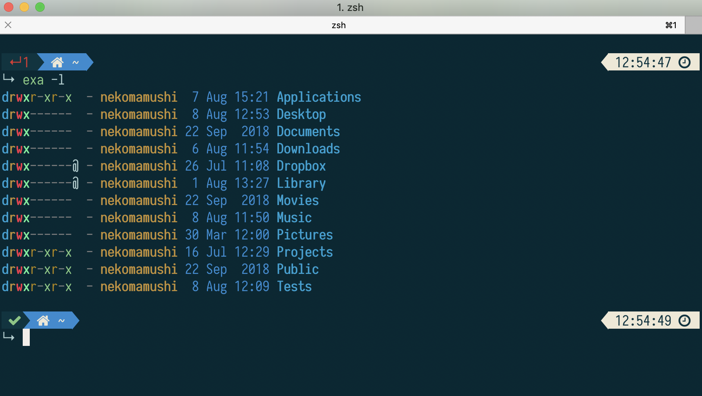
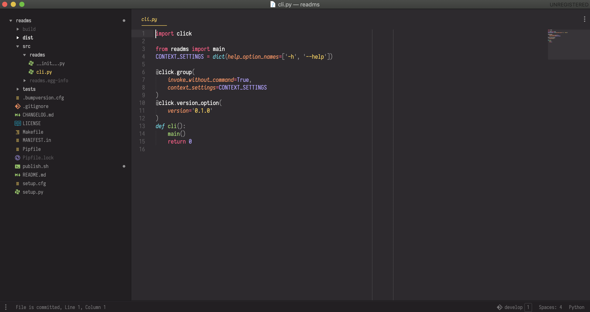
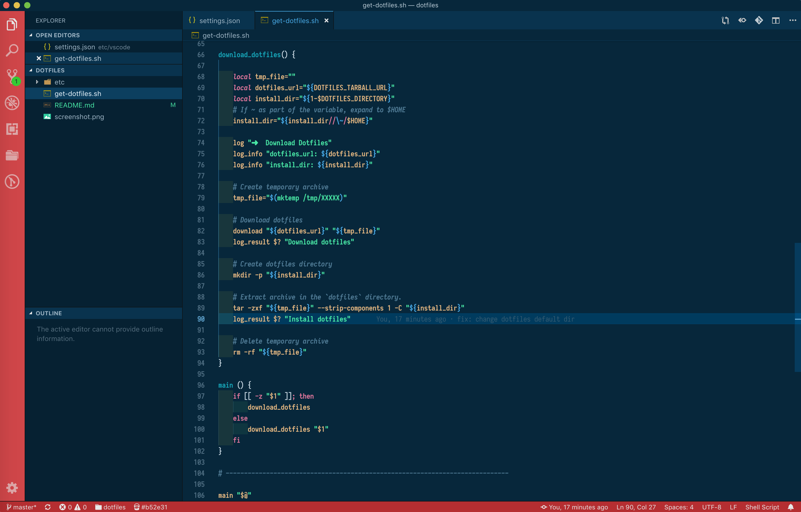

# @nekomamoushi does dotfiles

## Installation

Default Installation Directory

```
curl -LsS https://raw.github.com/nekomamoushi/dotfiles/master/get-dotfiles.sh | bash -s
```

## Features

- bin
- [cron](etc/cron/README.md)
- git
- python
- zsh
- [sublime-text](etc/sublime/README.md)
- themes
- vim
- [vscode](etc/vscode/README.md)

## Screenshots

### Terminal


### Iterm



### Sublime Text



### Visual Studio



## License

The code is available under the [MIT](LICENSE) license.
