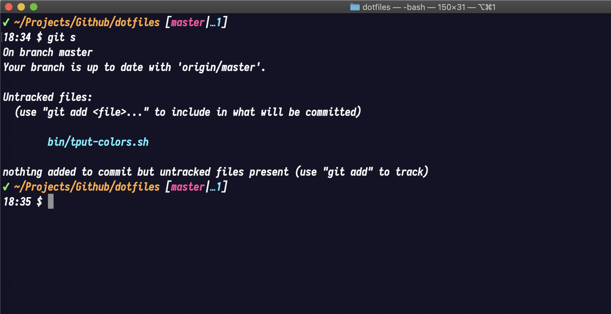
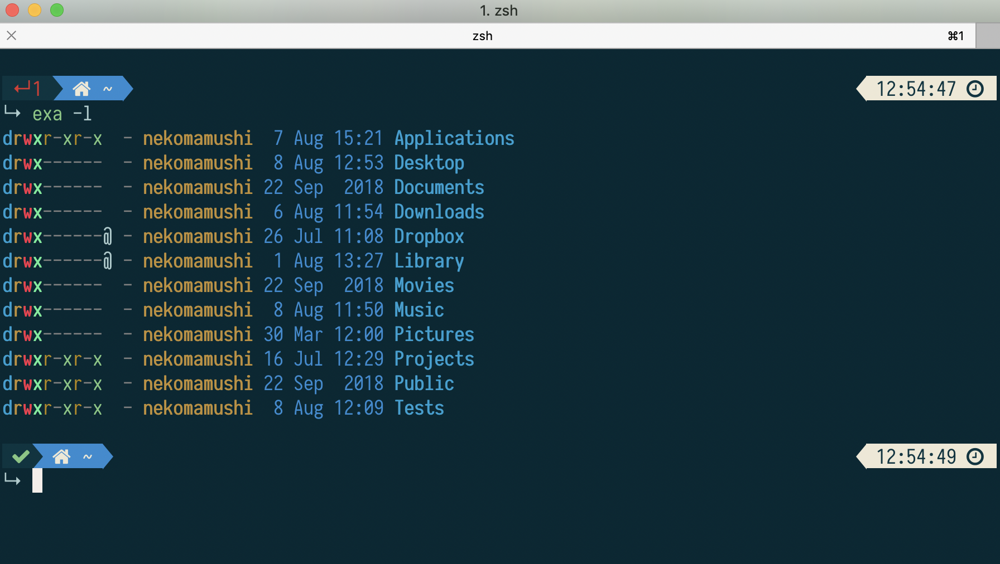
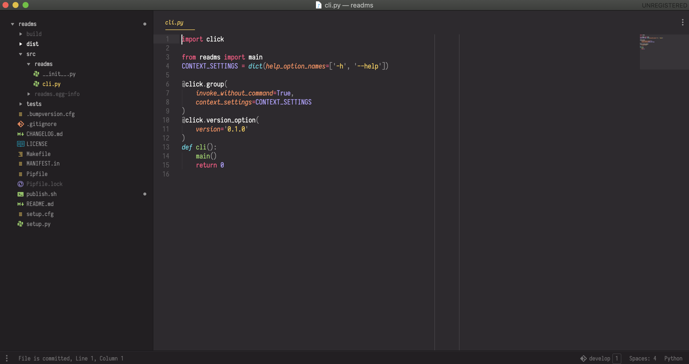
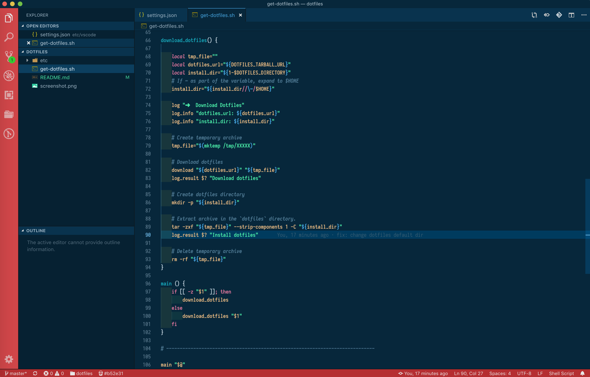

# @nekomamoushi does dotfiles

## Installation

Default Installation Directory

```
curl -LsS https://raw.github.com/nekomamoushi/dotfiles/master/get-dotfiles.sh | bash -s
```

## Features


## Screenshots

### Terminal



### Iterm



### Sublime Text



### Visual Studio



## License

The code is available under the [MIT](LICENSE) license.